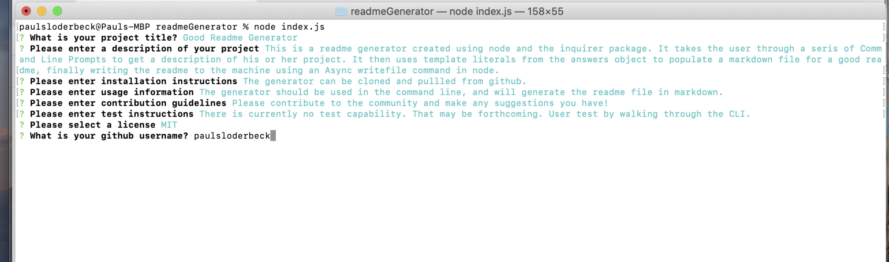

# Good Readme Generator

## Table of Contents
- [Good Readme Generator](#good-readme-generator)
  - [Table of Contents](#table-of-contents)
    - [Description](#description)
    - [Installation](#installation)
    - [Usage](#usage)
    - [Contributing](#contributing)
    - [Tests](#tests)
    - [License](#license)
    - [Questions](#questions)

### Description
This is a readme generator created using node and the inquirer package. It takes the user through a seris of Command Line Prompts to get a description of his or her project. It then uses template literals from the answers object to populate a markdown file for a good readme, finally writing the readme to the machine using an Async writefile command in node.
### Installation
The generator can be cloned and pullled from github.
### Usage
The generator should be used in the command line, and will generate the readme file in markdown.
### Contributing
Please contribute to the community and make any suggestions you have!
### Tests
There is currently no test capability. That may be forthcoming. User test by walking through the CLI.
### License
This application features a MIT license.
### Questions
Please find me on github at <https://github.com/paulsloderbeck>
You can also contact me directly at paul.sloderbeck@gmail.com with any additional questions.

